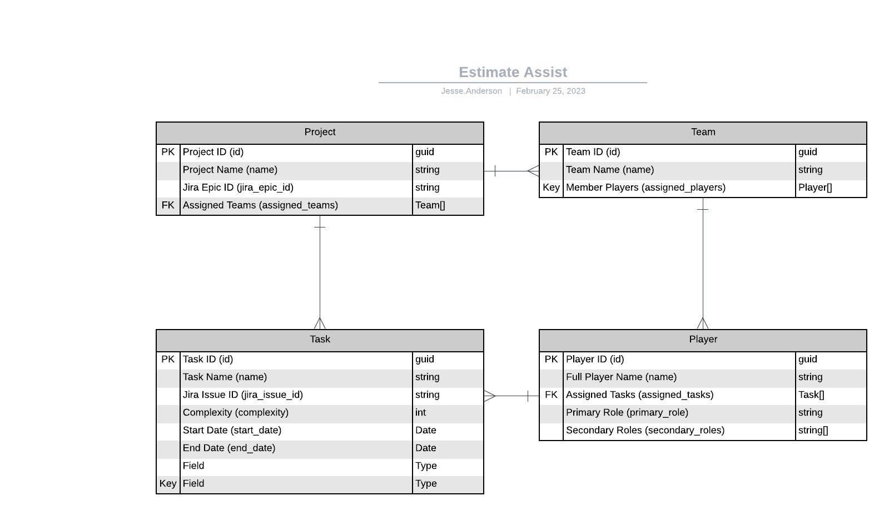
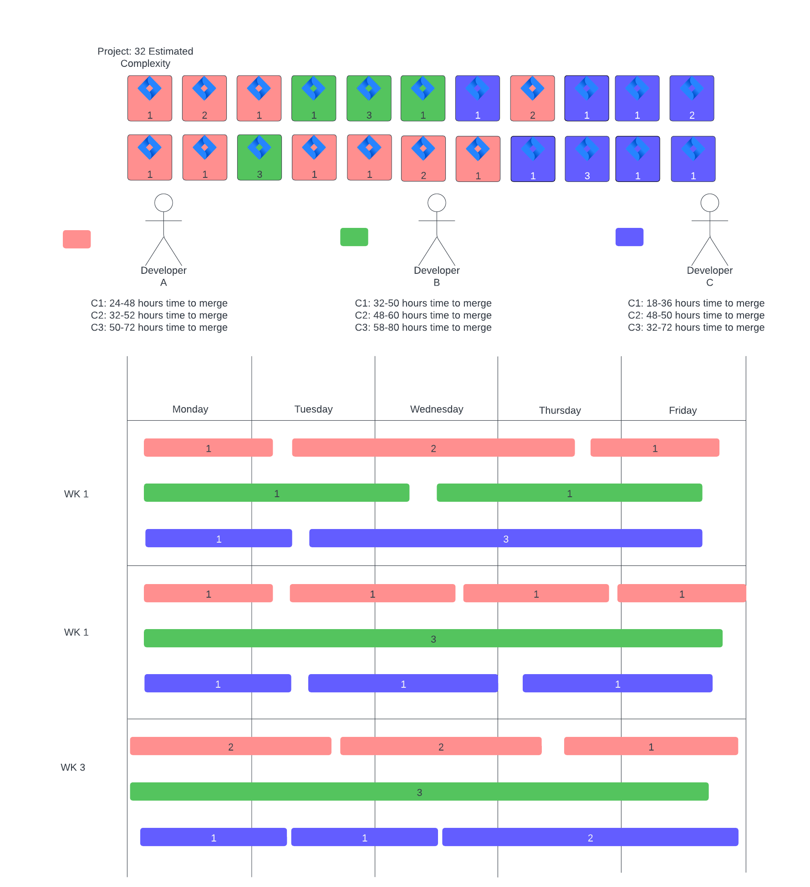

# 0001. Estimate Assist Design

Date: 02-25-2023

## Status

Proposed

## Decision

Architecture

## Context

Estimate Assist (EA) will programmatically retrieve Jira data for complexity analysis and predictive developer utilization. 

## Consequences

EA will pull Jira EPIC and its related Issues and measure a customer field in Jira.

An _estimate_ is the total amount of time it takes to deliver all the projected complexity for a given project.

### Developer Analytics

EA provides estimates based on the interpreted historical data for a given developer, and totals up all developer data on a team for a given project. 

If you have a team of 3 developers:

Developer A (DA) has the following matrix of development speed in CX for complexity:

C1: 24-48 hours time to merge
C2: 32-52 hours time to merge
C3: 50-72 hours time to merge

Developer B (DB) has the following:

C1: 32-50 hours time to merge
C2: 48-60 hours time to merge
C3: 58-80 hours time to merge

Developer C (DC) has the following:

C1: 18-36 hours time to merge
C2: 48-50 hours time to merge
C3: 32-72 hours time to merge

DA and DB are ideal scenarios. DC is a bit uneven. Maybe not enough data.

Now, if you have them all in a project where the total cards are estimated to be 39 (from a developer estimation on the cards.) You can use the breakdown of complexity in the cards to assume a random distribution of cards worked through in priority order. Furthermore, you can adjust the model to distribute certain cards more heavily to one developer to be able to predict through a model what the outcome of development would be given all that we know.

During development, as cards are completed and github repositories are checked in, the cards in Jira are updated. The final time to completion (e.g. 28 hours) is logged for the player with the complexity of the card as a statistic for further analysis. So as the developers complete cards, the results are analyzed and feed directly into the model of the estimate. The estimate leverages the past completed cards as the basis for estimates in a function with a given complexity.

### Automating Estimates

In this example, 

This process can be automated. Therefore, through automation we can get insight into how long a development effort will take and adjust our formulas to allow for more realism in scenarios (e.g. PTO, sick days, etc.)